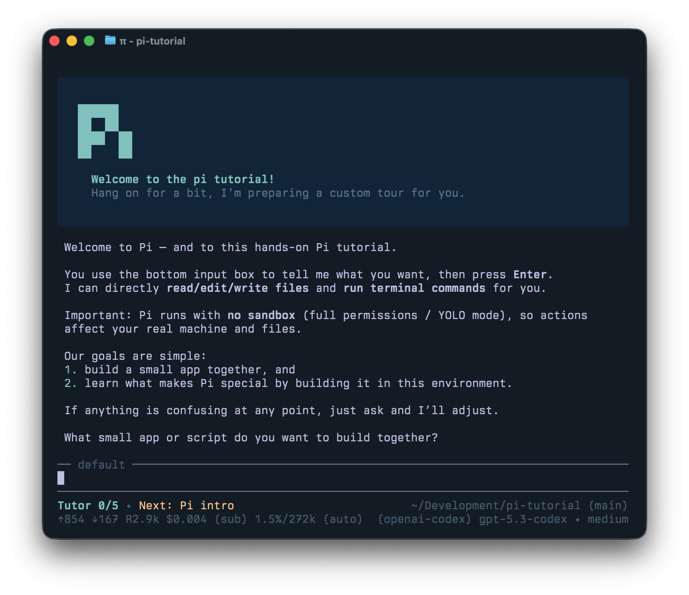

# Pi Tutorial

This repository contains an experimental interactive Pi tutorial extension.  To
test it, ensure you have a model loaded and run pi like this:

```bash
pi -e https://github.com/earendil-works/pi-tutorial
```

## Screenshot


